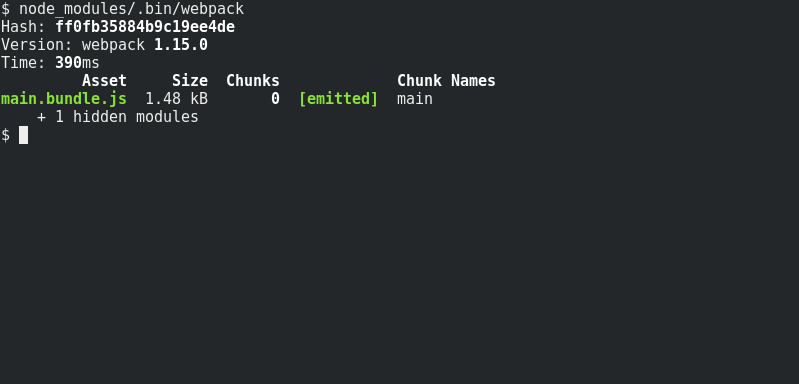
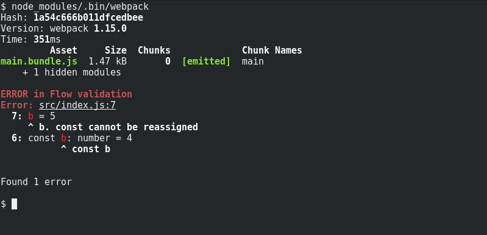

# flow-webpack-plugin

A webpack plugin allowing to call [Flow][2] type checker during each webpack compilation.

[]()
[]()
[]()
[]()

## Key features

* It doesn't require `flow` to be in `$PATH`.
* No dependencies. Plugin can reuse project's `flow-bin` installation.
* It can make `webpack` to exit with non-zero return code, if flow validation fails.
* It works per project, not per file.

## Installation

Run in you project directory:

```
npm install --save-dev flow-webpack-plugin flow-bin
```

or using yarn:

```
yarn add flow-webpack-plugin flow-bin --dev
```

Add to your webpack configuration file `webpack.config.js`:

```js
const FlowWebpackPlugin = require('flow-webpack-plugin')

module.exports = {
    plugins: [
        new FlowWebpackPlugin(),
        // ...
    ],
    // ...
}
```

*Note:* `flow-bin` package is not a hard dependency. If flow is already installed on your system,
it can be reused through `flowPath` option.

## Screenshots

Valid codebase:  


Flow validation error:  


## Configuration

Constructor of `FlowWebpackPlugin` accepts optional configuration object of following properties:

```js
const FlowWebpackPlugin = require('flow-webpack-plugin')

new FlowWebpackPlugin({
    failOnError: false,
    failOnErrorWatch: false,
    reportingSeverity: 'error',
    printFlowOutput: true,
    flowPath: require.main.require('flow-bin'),
    flowArgs: ['--color=always'],
    verbose: false,
    callback: (result) => {}
})
```

| option | type | default value | description |
| --- | --- | --- | --- |
| `failOnError` | `boolean` | `false` | Webpack exits with non-zero error code if flow typechecking fails. |
| `failOnErrorWatch` | `boolean` | `false` | Webpack in watch mode exits with non-zero error code if flow typechecking fails. |
| `reportingSeverity` | <code>'warning' &#124; 'error'</code> | `'error'` | Webpack severity level of reported flow type problems. When using webpack-dev-server, page reload is blocked in case of webpack error. `warning` can be used to enable page reloads in case of flow errors when using webpack-dev-server. |
| `printFlowOutput` | `boolean` | `true` | `true` ~ Output of `flow` is printed at the end of webpack compilation in case of error, `false` ~ output of `flow` is discarded. |
| `flowPath` | `string` | `require('flow-bin')` if `flow-bin` package is installed. Otherwise the parameter is required. | Path to flow executable. It may be both absolute, relative to the 'cwd' of webpack process or just name of an executable on the PATH.
| `flowArgs` | `Array<string>` | `['--color=always']` if standard output is directed to a terminal, otherwise `[]` | Flow command line arguments. See [flow cli documentation][1]. |
| `verbose` | `boolean` | `false` | It enables plugin logging for debug purposes. |
| `callback` | `({exitCode: number, stdout: string, stderr: string}) => ?Promise<any>` | `(result) => {}` | Custom user function that is called when Flow check finishes and is passed Flow type check result. If function returns a promise, it is called asynchronously. |
  
## Type annotations strip

This plugin performs type validation of the code. To remove the Flow type annotations and
create pure Javascript code [babel-plugin-transform-flow-strip-types][3] can be used.

[1]: https://flowtype.org/docs/cli.html
[2]: https://flowtype.org
[3]: https://www.npmjs.com/package/babel-plugin-transform-flow-strip-types
