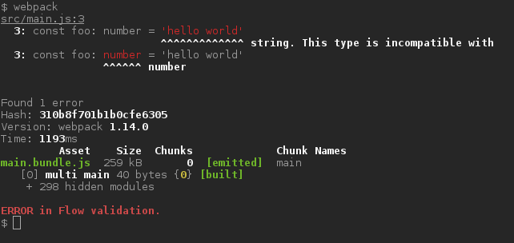

# flow-webpack-plugin

A webpack plugin allowing to call [Flow][2] type checker during each webpack compilation.

## Key features

* It doesn't require `flow` to be in `$PATH`.
* No dependencies. Plugin can reuse project's `flow-bin` installation.
* It can make `webpack` to exit with non-zero return code, if flow validation fails.
* It works per project, not per file.

## Installation

```
npm install --save-dev flow-webpack-plugin
```

Webpack configuration file:

```js
const FlowWebpackPlugin = require('flow-webpack-plugin')

module.exports = {
    plugins: [
        new FlowWebpackPlugin(),
        //
        // or with configuration:
        //  
        // new FlowWebpackPlugin({
        //     failOnError: false,
        //     failOnErrorWatch: false,
        //     printFlowOutput: true,
        //     flowPath: require.main.require('flow-bin'),
        //     flowArgs: [],
        //     verbose: false
        // }),
        // ...
    ],
    // ...
}
```

## Configuration

Constructor of `FlowWebpackPlugin` accepts optional configuration object of following properties:

* `failOnError: boolean`, default: `false`  
  Webpack exits with non-zero error code if flow typechecking fails.
* `failOnErrorWatch: boolean`, default: `false`  
  Webpack in watch mode exits with non-zero error code if flow typechecking fails.
* `printFlowOutput: boolean`, default: `true`  
  `true` ~ Output of `flow` is redirected to stdout/stderr of webpack, `false` output of `flow` is discarded.
* `flowPath: string`, default: `require('flow-bin')` if `flow-bin` package is installed. Otherwise the parameter
   is required.  
  Path to flow executable. It may be both absolute, relative to the 'cwd' of webpack process or just name
  of an executable on the PATH.
* `flowArgs: Array<string>`, default: `[]`  
  Flow command line arguments. See [flow cli documentation][1].
* `verbose: boolean`, default: `false`  
  It enables plugin logging for debug purposes.
  
## Type annotations strip

This plugin performs type validation of the code. To remove the Flow type annotations and
create pure Javascript code [babel-plugin-transform-flow-strip-types][3] can be used.

## Screenshots

Valid codebase:  


Flow validation error:  



[1]: https://flowtype.org/docs/cli.html
[2]: https://flowtype.org
[3]: https://www.npmjs.com/package/babel-plugin-transform-flow-strip-types
